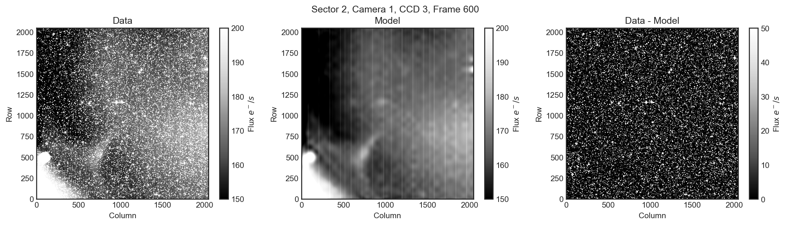

# TESS Backdrop
<a href="https://github.com/ssdatalab/tess-backdrop/workflows/tests.yml"></a>
<a href="https://pypi.python.org/pypi/tess-backdrop"></a>

Check out the [documentation](https://ssdatalab.github.io/tess-backdrop/).

`tess-backdrop` is a tool to 1) create a background correction for TESS images 2) apply a background correction to any block of TESS data.

# What does `tess-backdrop` make?

`tess-backdrop` makes sets of *fits* files for every TESS sector, camera and CCD. These fits files are quite small (10s of Mb) and contain all the information needed to create a scattered light background correction for any pixel, at any time. Below is an example of the sorts of corrections `tess_backdrop` makes.



Each of the background estimates is fast to evaluate for any given TESS FFI dataset. This means you can apply the scattered light correction really quickly, without having to download anything else from MAST.

# How do you install `tess-backdrop`?

You can install with pip using

`pip install tess-backdrop`


# How do you use `tess-backdrop`?

There are tutorials available on our [documentation](https://ssdatalab.github.io/tess-backdrop/) pages. Here are some really simple examples. You can obtain a TESSCut TPF using `lightkurve`

```python
import lightkurve as lk
tpf = lk.search_tesscut('TIC 441075486', sector=2).download(cutout_size=(20, 21), quality_bitmask=None)
```

You can then correct the background in the TPF using

```python
import tess_backdrop as tbd

b = tbd.BackDrop()
b.load(sector=2, camera=1, ccd=3)
corrected_tpf = b.correct_tpf(tpf)
```

Or you could create a corrected light curve using

```python
r = tbd.TESSCutCorrector(tpf, aperture_mask=tpf.create_threshold_mask())
corrected_lc = r.correct(npca_components=10, spline_timescale=1)
```
