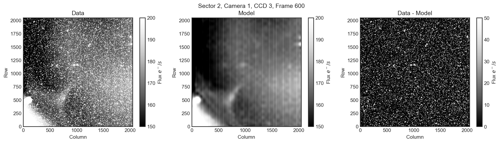
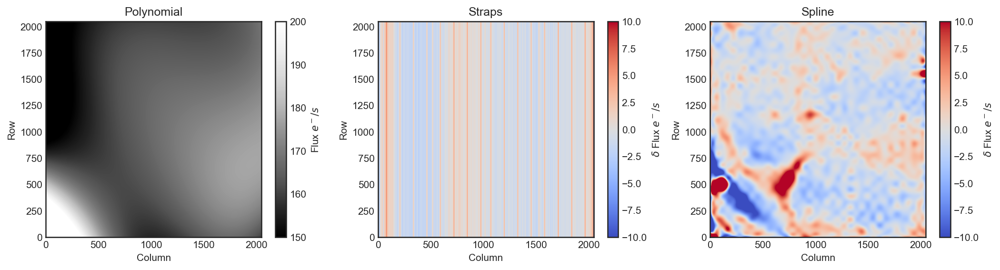

# tess-backdrop

`tess-backdrop` is a tool to 1) create a background correction for TESS images 2) apply a background correction to any block of TESS data.

# What does `tess-backdrop` make?

`tess-backdrop` makes sets of *fits* files for every TESS sector, camera and CCD. These fits files are quite small (10s of Mb) and contain all the information needed to create a scattered light background correction for any pixel, at any time. Below is an example of the sorts of corrections `tess-backdrop` makes.

Each of the background estimates is fast to evaluate for any given TESS FFI dataset. This means you can apply the scattered light correction really quickly, without having to download anything else from MAST.

## How is it fast?

`tess-backdrop` creates a simple linear model of polynomials and splines (piece-wise polynomials) for the background. These polynomials can be built very quickly. We save the optimum weights for each component in the light weight *fits* files that come with the package. These polynomials are then simply evaluated at points requested by the user.

# What sort of model is `tess-backdrop` building?

To make the background estimate, we construct a model that is a simple, low order, 2D polynomial. We then allow for small deviations from this model, in the form of a pixel column offset (to model straps in the TESS detector) and a 2D spatial spline model. An example of the different components of the model for the example frame is given below.

These model components are summed to create the final model for a given frame. `tess-backdrop` builds the model from FFI images, having masked out stars and bleed columns/halos in the FFIs. `tess-backdrop` uses simple statistics for this clipping, and doesn't query any catalog for the positions of stars.
